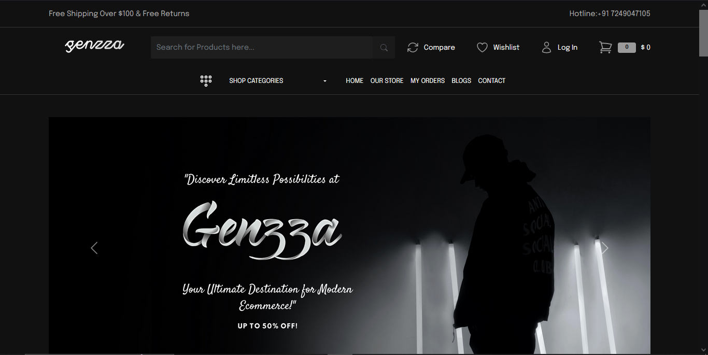
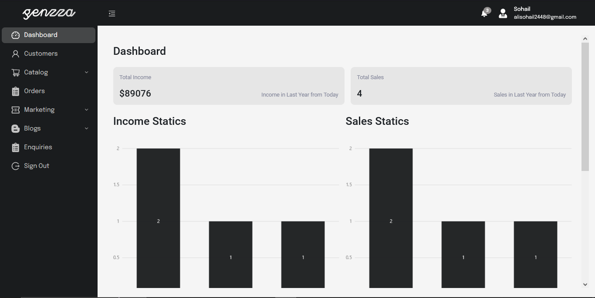

Genzza E-Commerce

Genzza E-Commerce is a full-stack e-commerce web application built with React, Node.js, Express.js, and MongoDB. It provides a user-friendly interface for customers to browse and purchase products, as well as an admin dashboard for managing products, orders, and user accounts.
Features

    User authentication and authorization:
        Sign up and login functionality for customers.
        Admin login to access the admin dashboard.
        Role-based access control for admin features.
    Product management:
        Add, edit, and delete products from the admin dashboard.
        Categorize products by brand and category.
        Product search and filtering for customers.
    Cart and checkout:
        Add products to the cart and update quantities.
        Apply discount coupons during checkout.
        Place orders securely.
    Order management:
        View and manage orders in the admin dashboard.
        Update order status and track order fulfillment.
    Dashboard analytics:
        Monthly and yearly order income reports.
        Visual representations of sales data.

Tech Stack

    Frontend:
        React.js for building the user interface.
        Redux for state management.
        React Router for routing and navigation.
        Axios for handling API requests.
        Material-UI for UI components and styling.
    Backend:
        Node.js and Express.js for building the server.
        MongoDB for data storage.
        Mongoose as the MongoDB object modeling tool.
        JSON Web Tokens (JWT) for authentication.
        Bcrypt for password hashing.
    Additional Tools:
        Axios for API communication.
        React Hook Form for form validation.
        Toast notifications for user feedback.

Installation

    Clone the repository:

    bash

git clone https://github.com/alisohail2448/genzza-ecommerce.git

Navigate to the project directory:
Frontend
        
        
Admin
        

bash

cd genzza-ecommerce

Install the dependencies for the frontend and backend:

bash

# Install frontend dependencies
cd frontend
npm install

# Install backend dependencies
cd ../backend
npm install

Set up the environment variables:

    Rename the .env.example file in the backend directory to .env.
    Update the .env file with your own configuration values, such as the MongoDB connection URL, JWT secret key, etc.

Run the application:

bash
    #at the time of backend u have to make sure your project with database becuase i have use the .env file so plz make sure
    # Start the backend server
    cd backend
    npm run server

    # Start the frontend development server
    cd ../frontend
    npm start

    Access the application in your web browser:

    Open http://localhost:3000 to view the customer frontend.
    Open http://localhost:5000 to access the admin dashboard.

License

This project is licensed under the MIT License.
Acknowledgements

    React
    Node.js
    Express.js
    MongoDB
    Material-UI
    Redux
    React Router
    Mongoose
    Axios
    React Hook Form

